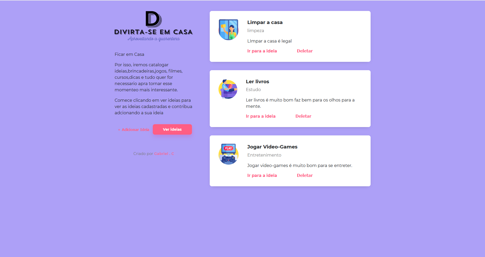
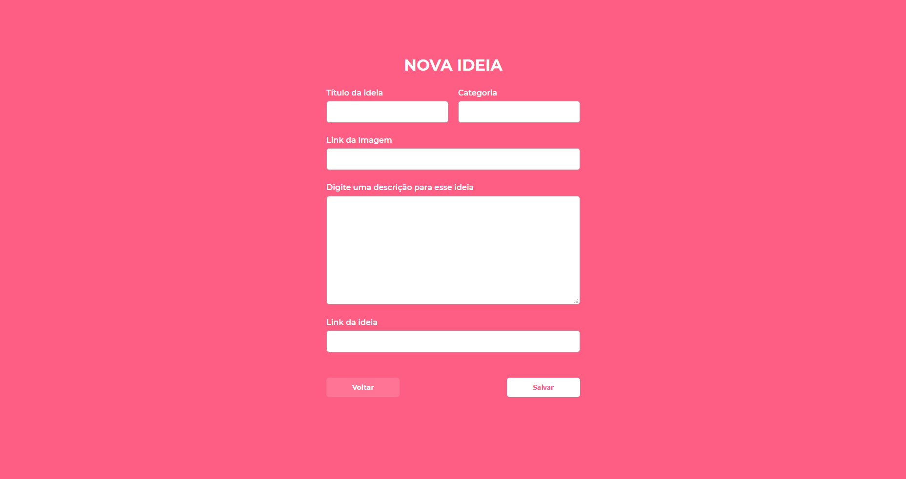

# Casa-Criativa-Site
Um site que armazena ideias do que fazer durante a quarentena. É um site bem simples criado com JavaScript,HTML e CSS. 
  No site você consegue adicionar novas ideias, e consegue visualizar as ideias que ja foram postas la.

## Pagina inicial do Site

  

## Pagina para visualizar todas as ideias postadas por usuarios

  

## Pagina para adcionar uma nova ideia

  